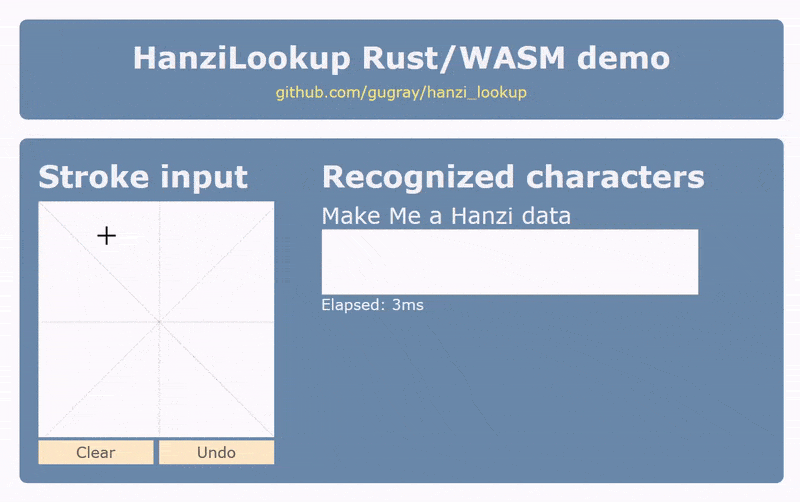

# hanzi_lookup

Free, open-source, browser-based Chinese handwriting recognition in Rust / WebAssembly

The library is a Rust port of [HanziLookupJS](https://github.com/gugray/HanziLookupJS), which is itself based on Jordan Kiang's [HanziLookup](http://kiang.org/jordan/software/hanzilookup). It contains data derived from Shaunak Kishore's [Make Me a Hanzi](https://github.com/skishore/makemeahanzi), and an improved character recognition algorithm.

Online demo: <https://gugray.github.io/hanzi_lookup>

## Getting started
If you are only interested in using the library in your own project, all you need is `hanzi_lookup_bg.wasm` and `hanzi_lookup.js`. These two files are the Rust library's output, and they are included in the `web_demo` folder.

- You can use `web_demo` directly if you publish it with a lightweight HTTP server, or even if you just open `index.html` directly from the file system.

- The demo project loads the WebAssembly module within a tiny Web Worker, contained in `worker.js`. This adds a little extra complexity to the demo because of the event-based communication between the Javascript in `index.html` and the Web Worker. But it's this setup that creates a really smooth user experience by offlading the costly character lookup from the browser's UI thread.

- The demo project includes `drawingBoard.js`, which is a simple component for drawing characters on the screen. It is not needed for `hanzi_lookup` itself to work, and if you do choose to use it, you also need to include jQuery in your page. The compiled library itself has no external dependencies.

- The WebAssembly module exposes one function, called lookup, accessible by calling `wasm_bindgen.lookup(strokes, limit)`, as seen in `worker.js`. The first parameter is an array of strokes. Every stroke, in turn, consists of an array of points. Every point is a two-dimensional array representing its X and Y coordinates. The second parameter is the maximum number of matching characters returned; 8 is a reasonable number here.

- The lookup function returns a JSON string, which you need to convert by `JSON.parse`. The result is an array of match objects, each of which has a `hanzi` member containing the character itself, and a `score` member. The array is ordered by score.

- The compiled library contains all the stroke information asm embedded binary data. For details about the origin of the strokes data file and its licensing, see the related sections below.
  
## The data file

The library no longer includes the original strokes data from Jordan Kiang's HanziLookup. You can still find it in my related project, [HanziLookupJS](https://github.com/gugray/HanziLookupJS).
 
The data in in this library is based on `mmah.json`, which is derived from Make Me a Hanzi's `graphics.txt` and encodes 9,507 characters. This file is richer than the Jordan Kiang's original because its substroke data also contains the normalized location (center point) of every substroke. The matching algorithm calculates the score accordingly: a substroke that is in the wrong place counts for less. Each substroke is represented by 3 bytes: (1) Direction in radians, with 0\-2\*PI normalized to 0\-255; (2) Length normalized to 0\-255, where 255 is the bounding square's full width; (3) Centerpoint X and Y, both normalized to 0\-15, with X in the 4 higher bits.

The Rust code loads strokes data from an embedded binary file. You can find the tiny tool I used to convert HanziLookupJS's JSON file into the binary format in the `mmah_json_convert` folder.

## License

This Rust library is derived from Jordan Kiang's original [HanziLookup](http://kiang.org/jordan/software/hanzilookup). In compliance with the original, it is licensed under [GNU LGPL](http://www.gnu.org/copyleft/gpl.html).

The strokes data is ultimately derived from the following fonts, via Make Me a Hanzi's `graphics.txt` and HanziLookupJS's `mmah.json`:
- Arphic PL KaitiM GB - https://apps.ubuntu.com/cat/applications/precise/fonts-arphic-gkai00mp/
- Arphic PL UKai - https://apps.ubuntu.com/cat/applications/fonts-arphic-ukai/

You can redistribute and/or modify `mmah.json` or the derived binary file under the terms of the Arphic Public License as published by Arphic Technology Co., Ltd. The license is reproduced in LICENSE-APL; you can also find it online at <http://ftp.gnu.org/non-gnu/chinese-fonts-truetype/LICENSE>.
